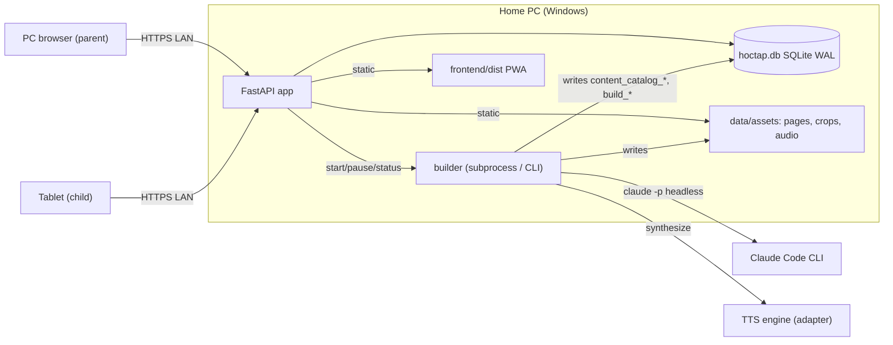
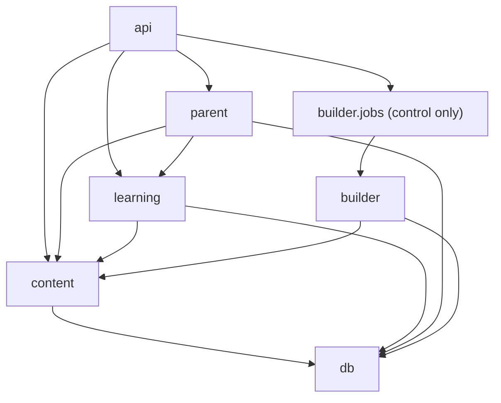
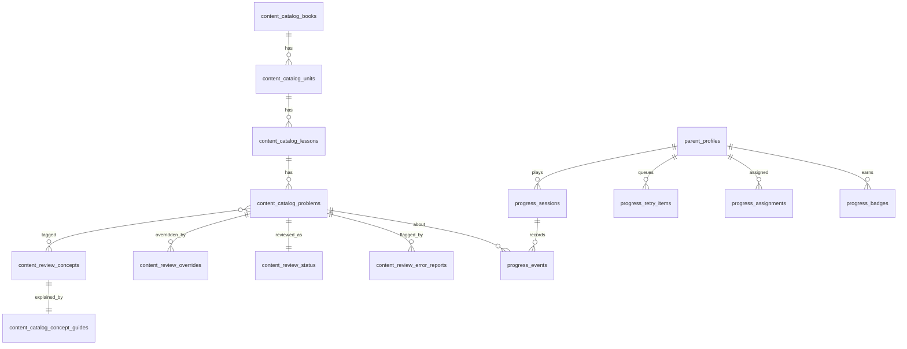
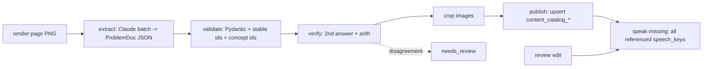
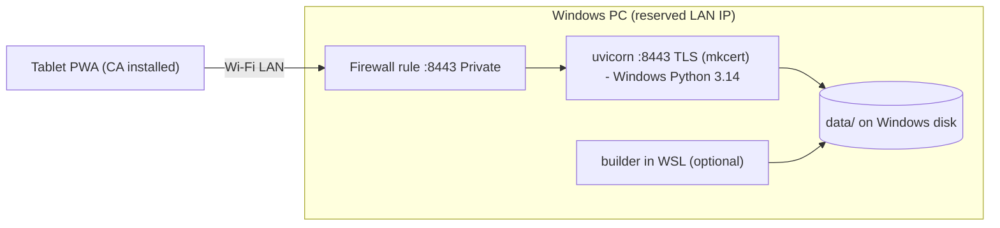

# Architecture Spine — Học Tập

## Design Paradigm

The system has two halves around one content contract:

- **Builder** (pipes and filters) runs rarely and needs internet. It turns scanned pages into content, then fills in any missing audio. Every stage is idempotent and resumable.
- **App** (modular monolith) runs daily and offline. It is one FastAPI process with layered modules: `content` (`catalog` + `review` + `speech`) → `learning` → `parent`. It serves the React PWA and the assets.



Dependency direction (an arrow means "may import"; anything not drawn is forbidden):



## Invariants & Rules

### AD-1 — One canonical ProblemDoc contract with stable Part keys

- **Binds:** FR-2, FR-3, FR-9, FR-11, FR-12, FR-22; builder, content, learning, frontend
- **Prevents:** the extractor, grader, widgets, print renderer, overrides and Attempts each addressing Problems and Parts differently.
- **Rule:**
  - `ProblemDoc` (schema `v1`) is one Pydantic model in `hoctap/content/schema.py`.
  - Its Parts are a union discriminated by `type`, with type names exactly as in PRD FR-9.
  - Every Part carries a `part_key` (`a`, `b`, … from the book's own labels, or `p1`… in reading order when the book has none). Every Answer Slot carries a `slot_key`.
  - Everything that points into a Problem does so by (`problem_id`, `part_key`, `slot_key`), never by array position. This covers overrides, Attempts, Retry, graders and audio.
  - The extraction request sends `anthropic.transform_schema(ProblemDoc)` as `output_config.format`. The `validate` stage re-validates every result with Pydantic.
  - Frontend types are **generated** from OpenAPI with `openapi-typescript`, never hand-written.
  - A new Problem Type ships in one change that adds four things: a schema variant, a grader (`learning/graders/`), a widget (`frontend/src/widgets/<type>/`) and a print renderer.

### AD-2 — Table ownership by module in one SQLite database

- **Binds:** all persistence; NFR-6, NFR-7
- **Prevents:** two units writing the same table, and the builder wiping review work or progress.
- **Rule:**
  - There is one file, `data/hoctap.db`, in WAL mode. Each table prefix has exactly one writing module:

    | Prefix | Written only by |
    |---|---|
    | `content_catalog_*` | `builder` (through `content.catalog` upsert functions) |
    | `content_review_*` | `content.review` |
    | `progress_*` | `learning` |
    | `parent_*` | `parent` (settings, PIN) |
    | `build_*` | `builder` |

  - Other modules read only through the owning module's service functions.
  - `parent` and the child API change review data only by calling `content.review` services. This includes the child's 🚩.
  - Schema changes go through Alembic only.

### AD-3 — Stable identity for Problems and Concepts; retire, never delete

- **Binds:** FR-2, FR-4, FR-6, FR-17, FR-19
- **Prevents:** Attempts, the Retry Queue, overrides and Concept history pointing at the wrong thing after a re-extraction.
- **Rule:**
  - `problem_id` = `{book_id}.{unit_key}.{lesson_key}.{problem_label}`, for example `toan1-2020-q1.tuan01.tiet2.bai3`. It comes from the book structure, never from page order. `book_id` values are fixed in the Book catalogue (FR-1).
  - Re-extraction **upserts** by `problem_id`.
  - Retirement is scoped to the Lessons that were re-extracted. A Problem in such a Lesson that wasn't found again gets `retired_at` set. Nothing is ever deleted.
  - Concepts use a **curated per-Grade list** with stable `concept_id`s (`g1.so-sanh-so`). The list is owned by `content.review` and is seeded from the pilot's proposals.
  - Extraction must tag only existing `concept_id`s. A new one becomes a proposal in `content_review_concept_proposals`, and Problems wait untagged until Anh accepts it.

### AD-4 — Review is a field-level overlay with a base hash

- **Binds:** FR-4, FR-6, FR-21
- **Prevents:** re-extraction silently erasing or misapplying Anh's corrections.
- **Rule:**
  - An override row is (`problem_id` | `concept_id`, `part_key`?, `field`, `value`, `base_hash`), where `base_hash` is the hash of the extracted field when Anh edited it.
  - Only `content.effective_problem()` and `content.effective_concept_guide()` merge the extracted content with the overlay.
  - When a re-extraction changes a field whose override has a different `base_hash`, the Problem gets a `review_conflict` flag and appears in the review list. The override still wins.
  - Each Problem has one `content_review_status` row: `approved_hash`, `hidden`, and its Error Reports.
  - Approving records the current effective content hash. That clears `needs_review` until the content changes again.

### AD-5 — One visibility gate and one child projection

- **Binds:** FR-3, FR-6, FR-21; the UX hidden-Problem state
- **Prevents:** Library, Session, Assignment and Retry queries disagreeing about what the child can see, and any route leaking answers.
- **Rule:**
  - Child-facing selection goes only through `content.visible_to_child()`. A Problem is visible only if all of these hold:
    - it is not retired;
    - it is not hidden;
    - it has no open parent Error Report;
    - it is not `needs_review`, unless approved for the current hash.
  - Child-facing content goes only through `content.child_view()`. This projection carries no Answer Keys, Hints or Solutions.
  - A child's 🚩 creates an Error Report of kind `child`, which never changes visibility.

### AD-6 — Server-authoritative learning state from an append-only event log

- **Binds:** FR-11 to FR-17, FR-19, FR-20, FR-23; NFR-7
- **Prevents:** the client and the server scoring differently, and Stars, Streak or Retry drifting from what happened.
- **Rule:**
  - `progress_events` is append-only and is the source of truth. Event kinds: `attempt`, `hint_requested`, `solution_shown`, `fallback_revealed`, `self_marked`, `quiz_submitted`, `session_started`, `session_completed`.
  - Every event has a client-generated UUIDv7, so resending it is a no-op. It also carries the device's `occurred_at`, which decides the calendar day.
  - Only `learning` grades (one grader per type), releases Hints and Solutions, and derives Stars, Retry, Streak, badges, first-try accuracy and Assignment status. These are materialised in `progress_*` tables in the same transaction as the event.
  - `parent` dashboards read those materialisations and never recompute them.
  - A Session's `mode` is fixed at start, and the scoring rules are keyed by mode:

    | mode | Stars | Counts to leave the Retry Queue | Streak |
    |---|---|---|---|
    | `practice` | FR-16 | yes | yes |
    | `retry` | FR-16 | yes | yes |
    | `concept` | FR-16 | yes | yes |
    | `quiz` | FR-23 (graded at `quiz_submitted`; no Hints) | yes | yes |
    | `replay` ("Luyện lại bài sai") | none | no | no |

### AD-7 — Resumable, idempotent build pipeline with a gate

- **Binds:** FR-1 to FR-5; UJ-4
- **Prevents:** duplicate charges, half-built pages, and a full run skipping the pilot gate.
- **Rule:**
  - Each stage has a record in `build_jobs`, keyed by (`page_ref`, `stage`, `input_hash`). A stage is skipped when a `done` record with the same hash exists.
  - Page stages run in order: `render` → `extract` → `validate` → `verify` → `crop` → `publish`.
  - A separate global stage, `speak-missing` (AD-8), runs after `publish` and after any review edit.
  - Claude calls go through the **Claude Code CLI in headless mode** (`claude -p --output-format json --json-schema <schema> --system-prompt <extraction prompt> --tools Read --no-session-persistence`), one call per page, with bounded parallelism. The structured result is read from `structured_output`, and the cost from `total_cost_usd`. There is no API key and no Message Batches (user decision, 2026-09-27). The model is configurable (`--model`). [ASSUMPTION: model choice, see Deferred]
  - `verify` means an independent second answer plus `builder.arith.evaluate()`. Any disagreement sets `needs_review`.
  - `builder.jobs` is the only control surface (start, pause, status). A running Batch can't be stopped: Pause stops new submissions, and collects the in-flight results when they arrive.
  - The full run is refused until a `build_gate` row records Anh's approval. The metrics behind it:
    - `fallback_share` = pilot `fallback` Problems ÷ all pilot Problems.
    - `key_accuracy` = correct ÷ checked over a spot-check sample of at least 30, drawn at random and spread across Problem Types (the verdicts are stored by `content.review`).
    - `est_cost` = pilot cost per page × the pages remaining.

### AD-8 — Speech is content-addressed through one normaliser

- **Binds:** FR-6, FR-10, NFR-1, NFR-3
- **Prevents:** the same text being read two ways, stale audio after an edit, and UI phrases without audio.
- **Rule:**
  - `content.speech.speech_text(text)` is the single Vietnamese maths read-aloud normaliser (for example "<" → "bé hơn" (less than); $\overline{ab}$ → "số a b" (the number a b)).
  - `speech_key` = `sha256(NFC(speech_text) + voice_id)[:16]`, and the file is `data/assets/audio/<speech_key>.mp3`.
  - `effective_problem()` computes the keys, so an edit produces a new key automatically.
  - `speak-missing` synthesises every key that is referenced and has no file. That includes content, Concept Guides and the UI phrase catalogue `frontend/src/audio/phrases.vi.json` (Home labels, praise lines, badge names, states).
  - TTS is reached only through the `TtsEngine` adapter.
  - When a file is missing, the player greys out 🔊 and shows the text (UX).

### AD-9 — ProblemSetRef and frozen Sessions

- **Binds:** FR-7, FR-8, FR-14, FR-15, FR-17, FR-20, FR-22, FR-23
- **Prevents:** Assignments, the Library, printing and Concept practice each defining "the Problems in this set" differently, and chunks shifting when content changes.
- **Rule:**
  - A Problem Set is referenced only by `ProblemSetRef{kind: lesson|concept|retry|replay, key}`.
  - `learning.problem_sets.resolve(ref, profile)` is the only resolver. It returns the ordered visible `problem_id`s, and printing uses it too.
  - A Session **freezes** its `problem_id` list and its chunk (Sessions of at most 10, labelled "Phần i/n") when it starts. Later hide or approve actions don't change a started Session.
  - A Concept practice set is up to 10 visible Problems for that `concept_id`. Problems the child hasn't solved correctly on the first try come first, then Book order.

### AD-10 — Client Session bundle and event outbox

- **Binds:** FR-8, FR-9, FR-13, NFR-1, NFR-4, NFR-7; the UX "server unreachable" state
- **Prevents:** a Wi-Fi drop during a Session losing answers or freezing the player.
- **Rule:**
  - Starting a Session fetches its bundle: the `child_view` of each Problem, the crop and audio URLs, the phrase audio and the progress state. The service worker precaches the bundle's assets.
  - Events go to an IndexedDB outbox and are sent in order.
  - Help, grades and Stars appear only from the server's response. The client never grades.
  - When the outbox can't send, the UX "not connected" screen shows.

### AD-11 — LAN-only access, a PIN for the parent, and setup

- **Binds:** FR-18 to FR-22, NFR-2, NFR-6
- **Prevents:** a child reaching the Parent Area, and the app being exposed beyond the home.
- **Rule:**
  - The server binds to the LAN interface only.
  - `parent_settings` holds the bcrypt PIN hash, the child-profile settings and the auto-play flags.
  - `/api/v1/parent/*` and `/api/v1/build/*` require a signed httpOnly cookie issued after the PIN, with a 30-minute idle expiry.
  - While no PIN exists, only the first-run setup routes are open.
  - Child routes take a `profile_id` and can reach only `child_view`, their own `progress_*`, and the `content.review` child-flag service.

### AD-12 — Served over HTTPS on the LAN from one origin

- **Binds:** NFR-1, NFR-2, NFR-4; the UX's PWA install
- **Prevents:** service workers being disabled on plain `http://<LAN-IP>`, CORS issues, and frontend/API version skew.
- **Rule:**
  - FastAPI serves `frontend/dist` at `/`, the API at `/api/v1` and assets at `/assets-data/*`, all over TLS on one port.
  - The certificate is an mkcert local-CA certificate for the PC's **reserved** LAN IP (a DHCP reservation on the router). The CA is installed on the tablet.
  - Plain HTTP still works, without the service worker or install.
  - The frontend calls the API only through the generated client.

### AD-13 — Runs natively on Windows; WSL is for development only

- **Binds:** NFR-2; operations
- **Prevents:** the tablet being unable to reach a WSL2 NAT server, WSL shutting down when idle, and a whole-machine networking-mode change breaking Tailscale, WireGuard or Docker.
- **Rule:**
  - `hoctap serve` runs with a Windows Python 3.14 managed by `uv`, reading `data/` on the Windows disk.
  - One Windows Firewall rule allows the port on Private networks.
  - The builder may run on Windows or WSL, since both reach the same `data/`. The two never write at the same time (AD-14).
  - Autostart through Task Scheduler is optional. [ASSUMPTION: Anh agrees to a native Windows runtime]

### AD-14 — Single writer during builds, backup and restore

- **Binds:** NFR-7, FR-5
- **Prevents:** a restore or backup racing a running build, or tablets sending events into a database that has just been replaced.
- **Rule:**
  - Backup uses the SQLite online backup API and may run at any time.
  - Restore is allowed only while no build job is running. The app enters maintenance (503), replaces the file, runs Alembic upgrade, rotates the cookie-signing key (which logs out every PIN session), and bumps `db_epoch`.
  - Clients discard outbox events stamped with an older `db_epoch`.
  - Assets aren't in the backup (Deferred).

## Consistency Conventions

| Concern | Convention |
| --- | --- |
| Naming | Python modules `snake_case`. Tables use the AD-2 prefixes. TS components `PascalCase`. Problem Type ids exactly as in PRD FR-9. Glossary terms (PRD §3) are used verbatim in code: `Problem`, `Part`, `AnswerSlot`, `Session`, `Attempt`, `RetryQueue`, `Assignment`, `ErrorReport`, `Concept`, `ProblemSetRef`. |
| IDs | Content ids are structured strings (AD-3); `part_key` and `slot_key` per AD-1. Runtime rows and events are UUIDv7 strings. |
| Dates and time | UTC ISO-8601 in storage and the API. The calendar day (Streak, Retry, Assignment) is taken from the event's `occurred_at` in the `Asia/Ho_Chi_Minh` zone (from config). |
| API | REST JSON at `/api/v1`, with `snake_case` fields. Errors are `{"error": {"code": "<SNAKE_CODE>", "message": "<vi text>"}}` with the right HTTP status. `npm run gen:api` regenerates the TS client from OpenAPI. |
| Text | UTF-8 NFC everywhere. Vietnamese text is normalised to NFC before hashing, comparing or storing. |
| Maths notation | ProblemDoc text uses an inline LaTeX subset: `\overline{…}`, `\frac{…}{…}`, `<`, `>`, `=`, `\times`, `:`. One `<MathText>` component renders it: overlined digits with CSS overline in Nunito (DESIGN), `\frac` and anything else with KaTeX. `speech_text()` reads the same source. |
| Fonts and offline assets | Nunito is self-hosted as woff2 with the Vietnamese subset. The service worker precaches the app shell, the fonts, KaTeX and the phrase audio. Session assets are cached per AD-10. |
| Mutations | Only in module services, inside a transaction. API routers hold no logic. |
| Config and secrets | `hoctap.toml` plus environment variables (`ANTHROPIC_API_KEY`, TTS keys). No secrets in the database or the repo. |
| Logging and cost | stdlib `logging` as JSON lines to `data/logs/`. The builder writes the cost per batch to `build_costs`. |
| Audio in the browser | One shared `AudioPlayer`: a new clip or leaving the screen stops the current one. The first user tap unlocks audio (the iOS autoplay rule). |
| Motion | Honour `prefers-reduced-motion` in one `useMotion()` hook (DESIGN and EXPERIENCE rules). |
| Tests | pytest for graders, the scoring-by-mode table, `visible_to_child`, `effective_problem` merge and conflict, and pipeline idempotency. Vitest plus Playwright for widgets and UJ-1. |

## Stack

| Name | Version |
| --- | --- |
| Python (Windows runtime, via uv) | 3.14 |
| FastAPI | 0.141.1 |
| Uvicorn | 0.54.0 |
| Pydantic | 2.13.5 |
| SQLAlchemy | 2.1.1 |
| Alembic | 1.20.0 |
| anthropic (Python SDK) | >=1.8,<2 |
| PyMuPDF | 1.28.2 |
| Node.js | 24 LTS |
| React | 19.3.0 |
| Vite | 8.3.1 |
| @vitejs/plugin-react | 6.1.1 |
| TypeScript | 6.0.3 |
| vite-plugin-pwa (Workbox 7.4.1) | 1.3.0 |
| TanStack Query | 5.104.0 |
| React Router | 8.4.0 |
| openapi-typescript | latest compatible with TS 6 at scaffold time |
| KaTeX | 0.18.9 |
| mkcert | 1.4.4 |
| Starter | `npm create @vite-pwa/pwa` (react-ts), then upgrade to the versions above |

## Structural Seed

```text
hoctap/
  backend/hoctap/
    content/      # schema.py (ProblemDoc), catalog/, review/, speech.py, effective_*, visible_to_child, child_view
    learning/     # problem_sets (resolve), sessions, events, graders/<type>.py, scoring, retry, streaks, badges, assignments
    parent/       # auth (PIN), settings, dashboard queries, backup/restore
    builder/      # stages/, jobs (control), claude_client, arith, tts/ adapters, gate
    api/          # routers: child, parent, build, setup; static mounts
    db/           # engine, alembic/
  frontend/src/
    child/  parent/  widgets/<type>/  print/  audio/ (AudioPlayer, phrases.vi.json)  math/ (MathText)  api/ (generated)  sw/
  data/           # gitignored: hoctap.db, assets/{pages,crops,audio}, logs/, certs/
  Sach_Arch/      # source PDFs, read-only
```

Core entities (names and relationships only):



Build pipeline:



Deployment:



- **Environments:** there is only one, "home" on the Windows PC, plus a developer run on `localhost`.
- **Starting it:** `hoctap serve`; `hoctap build <pilot|full|speak-missing>` from the CLI or from the Parent Area.

## Capability → Architecture Map

| Capability / Area | Lives in | Governed by |
| --- | --- | --- |
| FR-1 to FR-5: extraction, gate | `builder/`, `content/catalog` | AD-1, AD-3, AD-7, AD-8 |
| FR-4, FR-6, FR-21: Concepts, Content Review, Error Reports, spot-check | `content/review`, `api/parent` | AD-2, AD-3, AD-4, AD-5 |
| FR-7, FR-8: Library, Home, Session split | `learning/problem_sets`, `api/child`, `frontend/child` | AD-5, AD-9, AD-10 |
| FR-9 to FR-11: player, audio, fallback | `frontend/widgets`, `frontend/audio`, `frontend/math` | AD-1, AD-8, AD-10 |
| FR-12 to FR-14, FR-23: grading, help, summary, quiz | `learning/graders`, `learning/scoring` | AD-6 |
| FR-15: Concept Guides and practice | `content/`, `learning/problem_sets` | AD-3, AD-4, AD-8, AD-9 |
| FR-16, FR-17: Stars, Streak, badges, Retry Queue | `learning/` | AD-6 |
| FR-18 to FR-20: profiles, PIN, dashboard, Assignments | `parent/`, `learning/assignments` | AD-6, AD-9, AD-11 |
| FR-22: printing | `frontend/print` via `resolve()` | AD-1, AD-9 |
| NFR-1, NFR-2, NFR-4: offline, devices, speed | PWA, TLS, deployment | AD-10, AD-12, AD-13 |
| NFR-7: backup and restore | `parent/backup` | AD-2, AD-14 |

## Deferred

- **TTS engine and voice:** chosen by the pilot listening test (Azure vi-VN neural vs Google Chirp 3 HD vs local VieNeu-TTS v3). It sits behind the AD-8 adapter.
- **Extraction model:** default `claude-opus-5`. Two alternatives are open: `claude-opus-5-5`, which is newer and lists lower per-token prices, and `claude-sonnet-5`, which is cheaper. Anh chooses using the pilot's cost and quality numbers. This only changes AD-7 configuration.
- **iPad service worker trusting a local-CA certificate:** verified in a spike on the real tablet during the pilot. The fallback is the plain-HTTP mode (AD-12).
- **The `hoctap.local` name:** optional. The reserved IP is enough for v1.
- **Claude prompt wording and ProblemDoc fields beyond the type union and keys:** owned by the pilot stories.
- **Backing up assets:** they can be regenerated, at a cost. v1 backs up the database only.
- **Adaptive practice, Tiếng Việt Problem Types, more than 4 profiles, cloud or remote access:** phase 2 or Non-Goals in the PRD.
